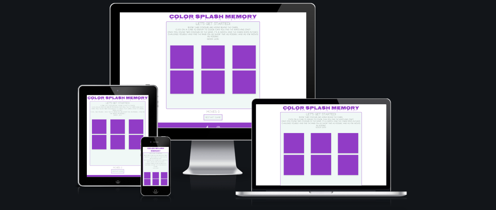
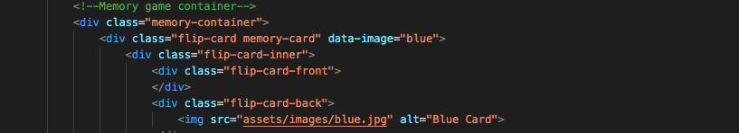
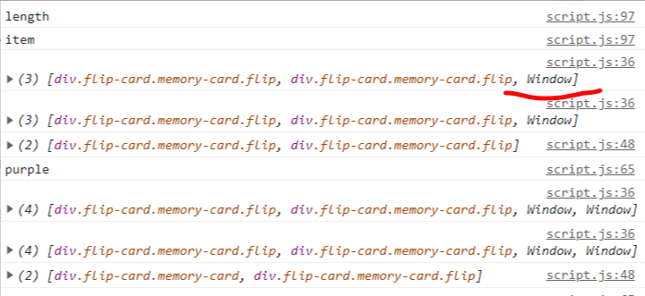
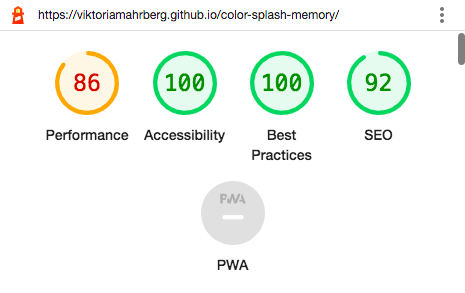
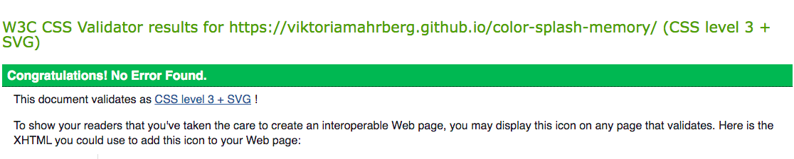

# Color Splash Memory Game
A game for the little ones, to learn colors in a playful way. This memory game has four colours hidden below it's cards and by clicking on each card the user is supposed to find its corresponding match!

# UX

## As a business owner:
* As a business owner I want to introduce an interactive game to the smaller ones that can learn to identify colors

## As a user:
* As a very young user I want to in an interactive way play a game to learn colors

## Features

The website is a one-page site with focus on the game itself. It is userfriendly and adapted to all sorts of devices. 

* Game is reset and starts as blank once a page is loaded.
* Moves: this section counts every move the user uses to find the pairs. One move is eaqual to two cards being showed.
* Alert: Once game is completed an alert window pops up congratulating the player.
* Start-again button: Once clicked upon the game is reset and the user can start a new round, where the cards have been shuffled and randomly replocated.
* Footer: Consists of social media tags 

## Future Implementations

A timer could be added to the game, but since the game is for the younger generation I did not think it was a required feature.

## Colors
- Background: #f7f6f1 (rgb(241, 247, 246))
- Features: #8553c0

## Fonts
- Logo: Nosifer
- Body: Poiret One
- Header: Codystar

Backup fonts: Sans Serif

# Technologies used

## HTML 
* The language to set the structure.

## CSS
* The language to style the page.

## Google Fonts
* As a font resource. 

## GitHub
* As a software hosting platform to store the project on in a remote location.

## Gitpod
* As a development hosting platform.

# Testing

## Functionality testing
* I used Google Developer tool *Inspector* throughout the development to imediately see the function of the site live and spot bugs. The *Console* has been very useful for Javascript. 

### Compatibility testing
* Site has been tested on devices between 1099px wide and down to 285px in Developer Tools, but mainly on my browser in MacBook Air 11'. 

## Issues found during site development

### Layout:
* Issues with the cards fitting and staying in the container has been a recurring problem on smaller devices. I should have set it up differently, in grids, from the beginning but tried to solve the issue with Media Queries for all devices down to 285px, by changing the size on the cards to fit into its game-container. 

* Images were loading very slowly although I resized them, so I used TINYPNG.com to compress them as well. 

### Javascript:
* My knowledge and understanding of Javascript was very weak in the beginning of this site development and I could not wrap my head around the logic of Javascript at all. I used tutorials on Youtube, lots of research on projects from other peers at Code Institue to even understand how to get started. 
Going back to the site after some time away from it and where my knowledge has improved I was very proud to solve the issues of the game not functioning and be able to follow the logic and see what I was missing in my functions. 

* Data-Image: I set up the card structure in HTML and with data-image attribute attached on each card, however they did not connect to Javascript by flipping. The issue I finally figured with one of the tutors at Code Institute was the placement of 'data-image', not being on the same div as ".memory-card". 
 

* Flip Cards: I used inspiration from [Marina Ferreira](https://www.youtube.com/watch?v=zYS4J9m3SsU&list=PLLX1I3KXZ-YH-woTgiCfONMya39-Ty8qw&index=5) to have my card flipped but due to mistakes between CSS and Javascript it did not work and I figured out another CSS structure from W3 Schools with my tutor. 

* Checking cards for match: Here I learnt that the functions need to have argument being passed into the function to work. I started setting up the functions with empty brackets wihch caused issues. 
Also that the array of the two flipped cards need to be empty in roder for two new cards to be flipped and checked for a match. This I solved with the slice method: *selectedPairs.splice(0, selectedPairs.length);*

* Moves-counter function: This did not work due to a space after *counter* but when I removed that it accumulated the scores. 
*document.getElementById("count-area-moves").innerHTML = counter++;*
The issue of the counter not adding the first round to the score was solved by changing the code to *counter++;
    document.getElementById("count-area-moves").innerHTML = counter;}*

* Overall I have had structural issues due to lack of knowledge, but have improved my skills with a lot of help from the tutors and online videos. 
It also became much easier when I started to add alerts, and once I got the hung of them add the console.logs to see the issues. 

## Bugs

* Game only flipps three cards: 
I could not figure out the very end and make the game work properly. I believe it is a bug in the DOM since game freezes after three cards being flipped. In the console it logs the value of "Window", so it looks like it is stepping out of the "document". 

* Moves-counter: The counter is set up and works but counts the moves after the third card being flipped. In the console it looks like it's an issue with my logic.

I solved above bugs by sitting down without any stress and tried to understand my logic with console.logging every tiny step of the flow to understand how it was behaving. This really helped, together with a github repo that I found very useful [Github - memory-game/blob/master](https://github.com/aadhavanm02/memory-game/blob/master/js/app2.js).
I am proud to say that I managed to solve the logic and make the game function without any assistance from Tutors nor Slack community. 

## Performance testing

I ran the site in Lighthouse to check its performance:

## Validation

I validated my codes and after a few adjustments at first it ran without any errors:

* [W3C CSS Validator](http://www.css-validator.org/) to validate CSS
* [Html Checker](https://validator.w3.org/) to validate HTML
* [Jshint Javascript Checker](https://jshint.com/) runs with no errors.
* [New Jshint Javascript features Checker(ES6)](https://jshint.com/) runs with no errors or warnings.

## Deployment

The page has been deployed to Github Pages following below steps:

* On the Github repository page navigate to Settings in the menu field.
Scroll down to Pages
* Under Source change the branch to main
* Press Save
* The site is published and can be found [here](https://viktoriamahrberg.github.io/color-splash-memory/).
* To run localy:
On the Github repository page, click Code button do download zip file
After download you can extract the file and use it in your local environment.

## Credits

### Assets
* Images from [Pexels](https://www.pexels.com/)

### Code / Tutorial video from: 
* Assistance and guidance from Code Institute Tutors, I would especially like thank Jo, Ger and John that have all helped me to improve my Javascript skills and actually understand what I was doing.
* Assistance from my Mentor Adegbenga Adeye
* [Code with Ania Kubów](https://www.youtube.com/watch?v=tjyDOHzKN0w)
* [Learn Vanilla Javascript: Memory Game Tutorial by Marina Ferreira](https://www.youtube.com/watch?v=zYS4J9m3SsU&list=PLLX1I3KXZ-YH-woTgiCfONMya39-Ty8qw&index=5) [GitHub](https://github.com/code-sketch/memory-game/blob/master/video-11/scripts.js)
* Code inspiration from fellow peers at Code Institute - Slack Forum
* [W3 SCHOOLS](https://www.w3schools.com/)
* [StackOverflow](https://stackoverflow.com/)
* Transition and 3D-flip effect on cards [W3 SCHOOLS](https://www.w3schools.com/howto/tryit.asp?filename=tryhow_css_flip_card)
* [Github repo: aadhavanm02 - memory-game](https://github.com/aadhavanm02/memory-game/blob/master/js/app2.js)

